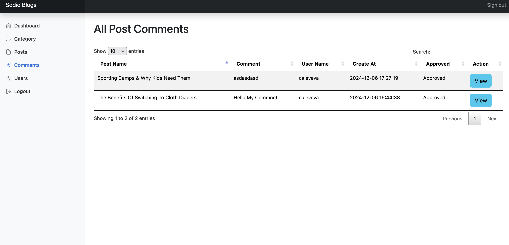

# Sodio-blogs

## Clone Git Repo. In XAMPP OR WAMP 

`git clone https://github.com/basantsd/Sodio-blogs.gits sodio-blogs`

`cd `sodio-blogs 

## Make Configration & Database

Go to config.php

```
define('DB_HOST', 'localhost');
define('DB_NAME', 'blog_db');
define('DB_USER', 'root');
define('DB_PASS', '');

define('BASE_PATH', realpath(__DIR__));
define('APP_URL', 'http://localhost/sodio-blogs/public');
define('UPLOAD_URL', 'http://localhost/sodio-blogs/uploads/');
```

APP_URL  : <your_project_url>/public or same as 

UPLOAD_URL : To Show Images

> ###### Import blog_db.sql file in database

## Composer Install & Dump

I have used PHPMailer library to send Mail and Autoload Files

`composer install `

`composer composer dump-autoload `

Now You Can Run Project :

## Functionality 

* Middleware
* Controller
* Validation
* Comment Approval
* Before Post Details view Or Comment User Login
* Admin Forgot Password
* User Login , Register
* Authentication and Authorization (User & Admin Both)


## Screenshots




